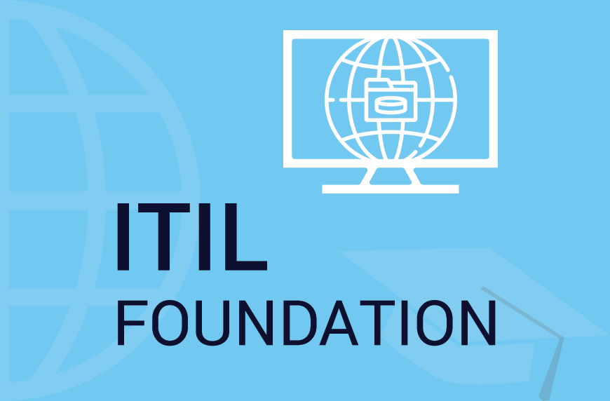

  

<h1 align="center">Hi , I'm <a href="https://www.linkedin.com/in/bharath-varma-87027493/" target="_blank" rel="noreferrer">Bharath Varma</a>👋 </h1>

<h3 align="center">I'm a Software Development Engineer in Test (SDET) 💻</h2>

  

## 🥇 Certifications

  

## 🔭 I'm currently working on

- Postman Newman Automated Test
- CICD pipeline creation with Docker,Docker Hub,AWS, jenkins and GitLab Webhooks
- Rest Assured Automation Framework

## 🌱 I'm currently learning

- I am currently learning creating Single Automation Framework that will be able to run UI/API/Mobile Automated Test automatically.

## 🥇 Achievements

-Implemented thorough manual testing strategies for the application, ensuring
seamless user experience and functionality across various devices which gave
<b>20% improvement in overall software stability and performance</b>

-Spearheaded the automation of repetitive test cases, resulting in a 50% reduction in
testing time and facilitating faster release cycles.

-Guided and trained 4 Junior QA team members on test automation best practices,
resulting in a  <b>40% decrease in test execution time and a 25% increase in test
coverage </b>

## 💻 My Projects

## 💼 Technical Skills

<a href="https://www.selenium.dev" target="_blank" rel="noreferrer"> 

<a href="https://www.selenium.dev" target="_blank" rel="noreferrer"> 

## 📈 GitHub Stats

&nbsp;

## Contact

I'm always open to new opportunities and collaborations. Feel free to reach out to me via email at <a href="mailto:bharathvarma@hotmail.com">bharathvarma@hotmail.com</a> or connect with me on <a href="https://www.linkedin.com/in/bharath-varma-87027493/">LinkedIn</a>.

  

  

Thank you for visiting my portfolio! I look forward to discussing how I can contribute to your projects and initiatives.

